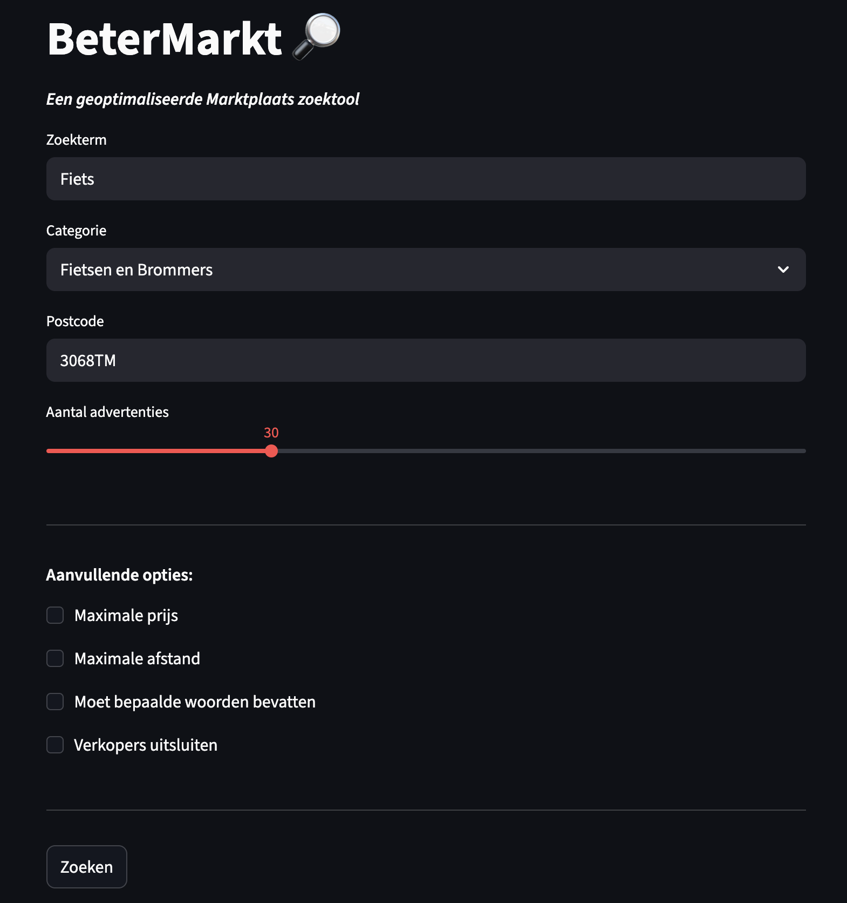
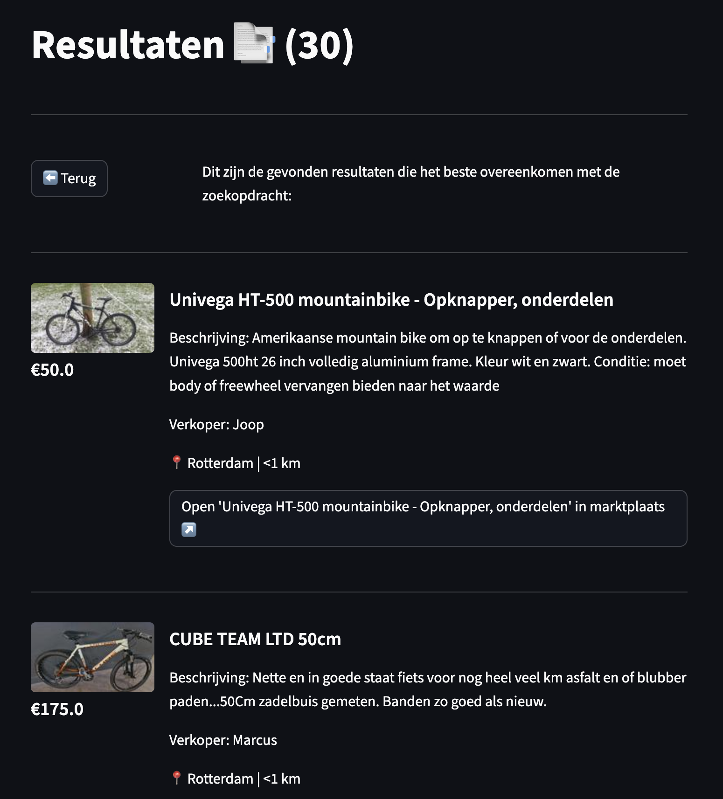

# BeterMarkt
Een verbeterde zoekmachine voor MarktPlaats, zonder gezeik.

## Waarom bestaat dit?
Het is tegenwoordig bijzonder lastig om te vinden waar je naar op zoek bent op Marktplaats.
De site zit vol met advertenties en schijnadvertenties zoals die van Catawiki. Dit vroeg om een simpelere UI met aanvullende opties om efficiënt en snel te vinden waar jij naar op zoek bent, zonder poespas.

### Aanvullende opties:
- **Filteren op afstand**
- **Maximale prijs**
- **'Moet bepaalde woorden bevatten'** --> handig bij specifieke modellen
- **Verkopers uitsluiten** --> advertenties weglaten van verschillende namen (zoals Catawiki).  

## Al geïnteresseerd?
De zoekmachine is te vinden op [betermarkt.streamlit.app](betermarkt.streamlit.app) 

## Voorbeeld
